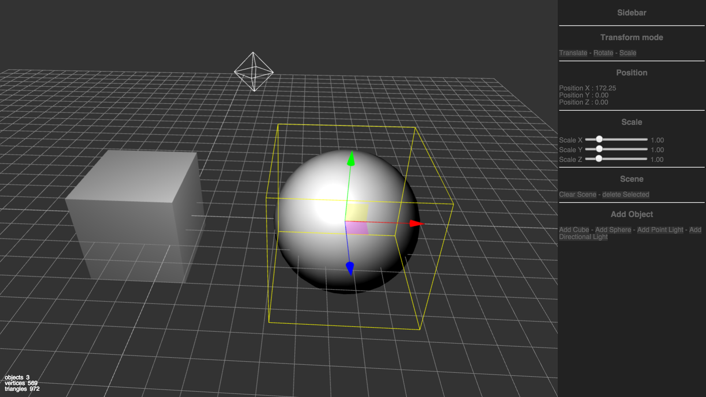
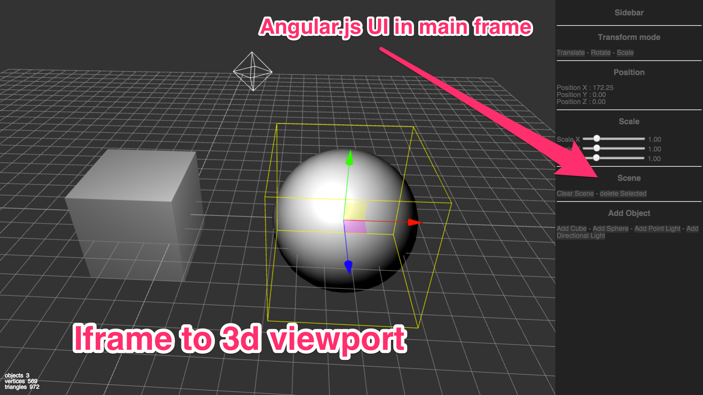

# Prototype Status
It is a limited prototype but it is running.
It has been coded fast as a proof of concept.
Still you can add lights, objects, clear the scene etc...
The UI is dynamic/live, aka moving a slider in UI modifies immediatly the object, as it is usual with angular.
And obviously it implement 
the **viewport-in-iframe** architecture.

Here is a screenshot

## Visible Parts

Here is what the prototype contains

- it has a viewport running in a iframe.
The viewport simply is the [three.js editor](http://threejs.org/editor).
i just removed the css to hide its specific UI.
- it has a UI running with angular.
The sidebar is in angular and contains a simple but functional UI.
It expose many cases we need to do for designer.

